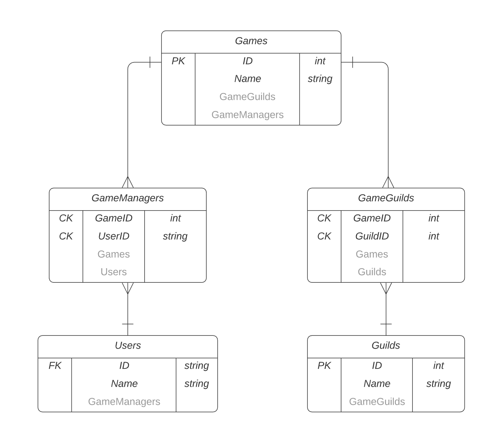
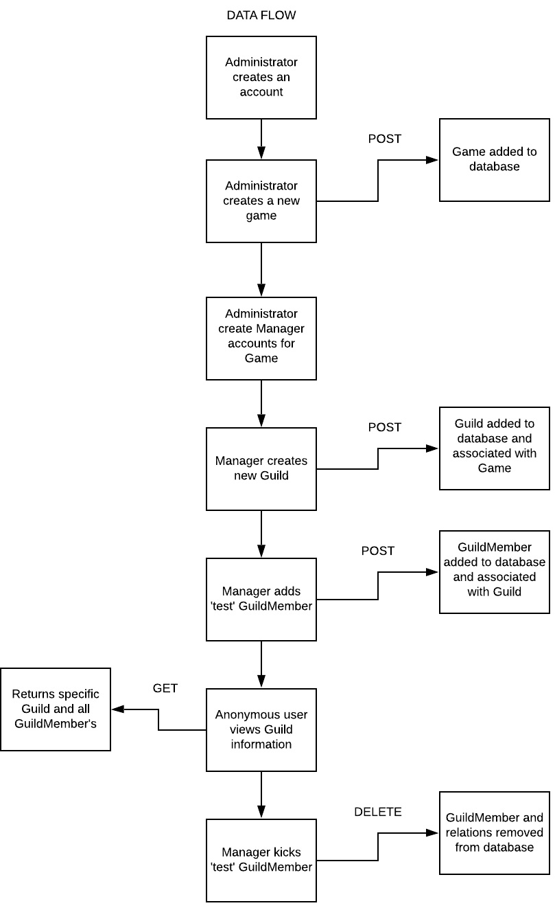
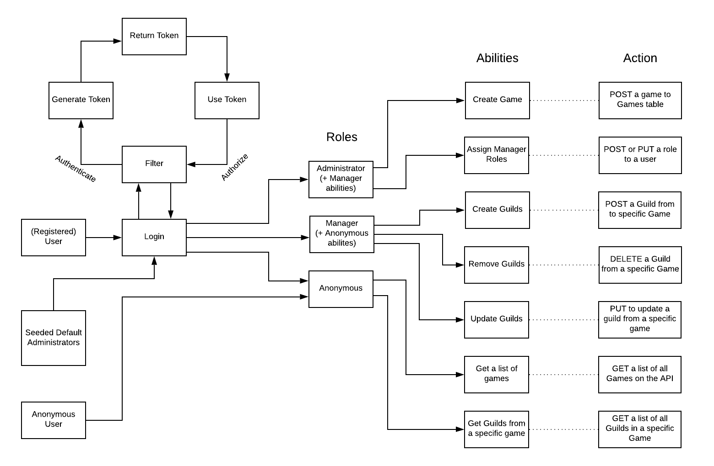

# GuildAPI
  
**Authors:** Bryant Davis, Lesley Rivera, Peyton Cysewski, Bade Habib  

# Description
This is a service that allows game developers to outsource their guild information

* Developers can make API calls on their servers to keep track of what guilds are in their games

* Developers will have their games registered into our databases.

* By default, the service allows clients to create new guilds within their games.

| Challenge      |Name       |
|----------|:-----------------------------------------------------------------------------:|
|[Process](#process) 	|Process Documention(ERD, Data Flow, Domain Model)       	|
|[ERD](#erd) 	|ERD       	|
|[Data Flow](#data-flow) 	|Data Flow    	|
|[Domain Model](#domain-model) 	|Domain Model    	|
|[API Calls](#api-calls) 	|API Calls    	|
|[Registration](#registration) 	|Register an Account    	|
|[Login](#login) 	|Login with your Account    	|
|[Guild](#guild) 	|Guild API Calls    	|
|[Create Guild](#create-guild) 	|Create Guild  	|

## Process

### ERD

### Data Flow

### Domain Model

## API Calls
In This section we will show you how to do each API call

### Registration
To register an account please Email us at admin@GuildApi.com with the following information:
* First Name
* Last Name
* Email address
* Name of Game(s)

### Login
`https://guildapi.azurewebsites.net/api/Account/Login
{
	"Email" : Admin@gmail.com
	"Password" : Testing123!@
}`

You will then receive a token that is good for 24hrs and will need to use this token for Authorization.

## Guild

### Create Guild

[Project Board]: https://github.com/JungDefiant/GuildAPI/projects/1
