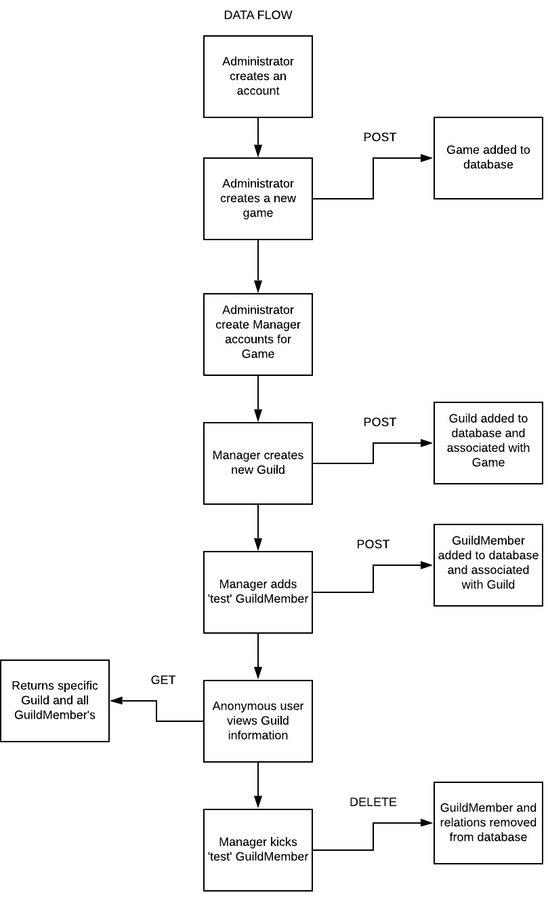
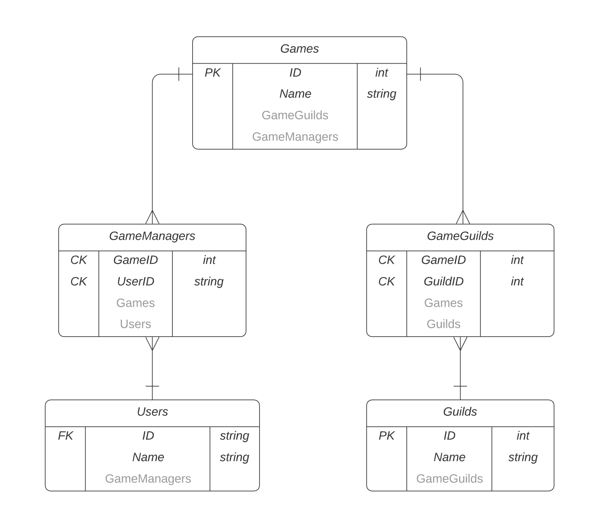

# Software Requirements

## Vision
Our Guild API team has set out to help other software engineers reduce their workload by creating an API for multiplayer development. 
This API will create the basic structure of a guild or clan with roles, permissions and a hierarchy. Our users will have store the user information
into a database on our server and be able to remove users from the database, change roles and anything else they require to make a functioning guild.

## Scope
### In
* The API Server will provide users the ability to create a Guild/Clan within their game and store that information into a database
* Users will be able to utilize the API for their game and/or a front end web application to display to their users all the guild/clan information
* Users will be able to delete a Guild/Clan within their game
* Users with Administrator privilege will be able to assign Managers to existing games

### Out
* Users will not be able to give permissions to their users to modify/delete the game database
* Users will not be able to download the code (not open source)

## Minimum Viable Product
What will your MVP functionality be?
- Administrator can create a new game and assign Managers to that game using a POST API call
- Managers can create new guilds in a game using a POST API call
- Manager can delete guilds in a game using a DELETE API call
- Any user can view all guilds in a game using a GET API call

### Stretch
- Develop a web app that makes Guild API calls from the backend
- Add the ability to organize Developers by Company
- Add GuildMembers to Guilds
- Add Ranks/Titles to GuildMembers in Guilds

## Functional Requirements
1) An Administrator will be able to create a database for games and full rights to the database they are assigned to.

2) A Manager will have full rights to guilds within the game they are assigned to. 

3) An Administrator and a Manager can create guilds.

4) An Administrator and a Manager can delete guilds.

5) An Anonymous user can view/get game information.

## Data Flow

## ERD

## Model Diagram

## Non-Functional Requirements
### Security
* Will be secured by only authorizing users with permissions to access the database
* DTO's will provide an additional layer of security
* API will be deployed on Azure which provides an additional layer of security

### Usability
* Will provide very clear documentation on how to do API Calls.
* Documentation will present the structure of what the JSON file will look like
* Documentation will include examples of API Calls
* Documentation will be as simplified as possible as to not overcomplicate it

